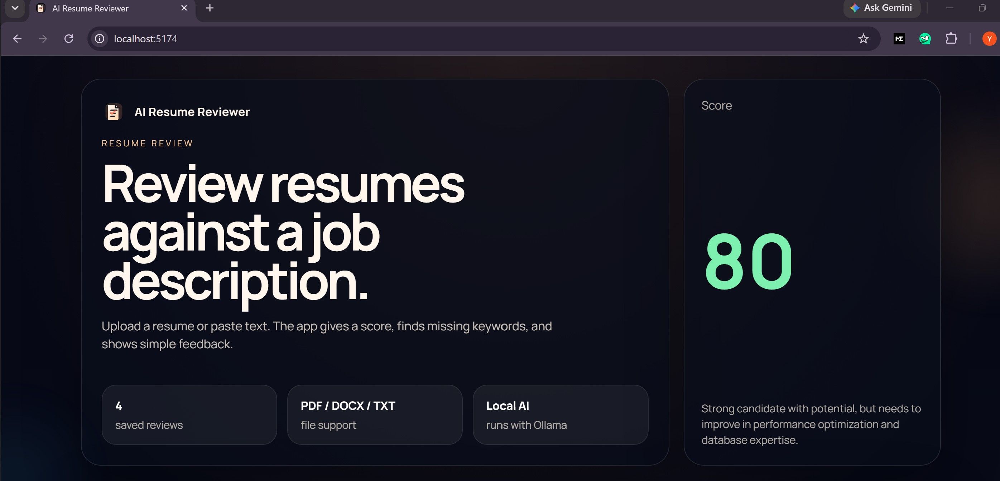
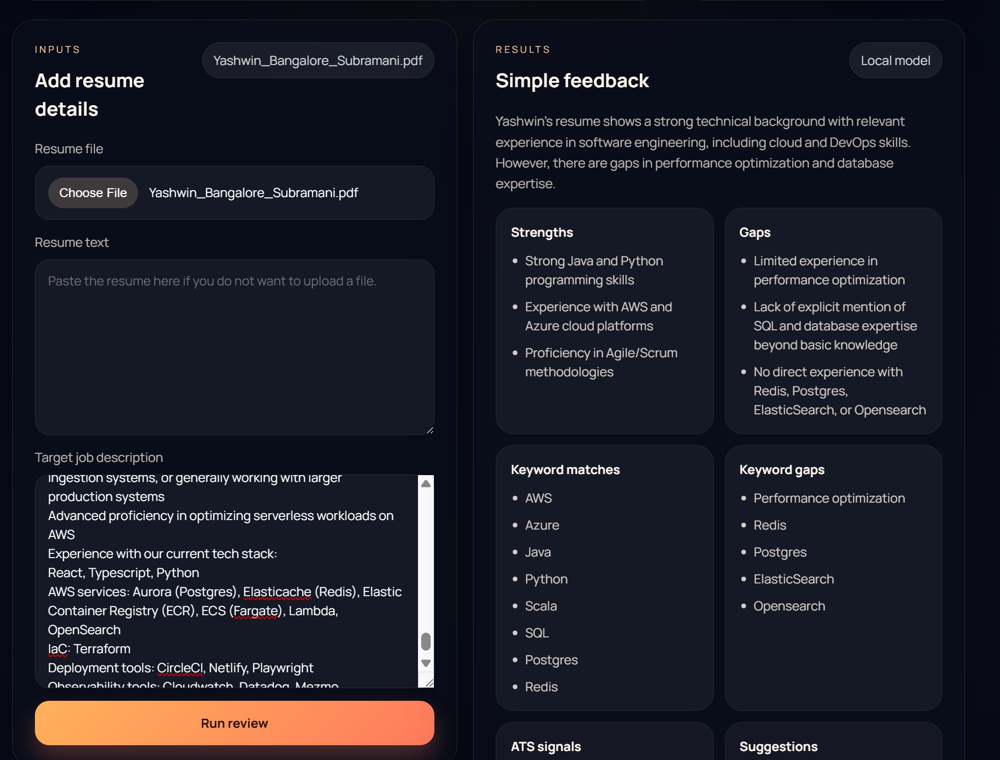
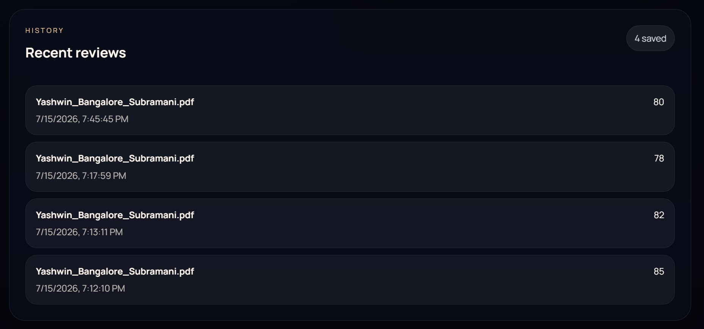

# AI Resume Reviewer







## Description

A simple full-stack resume reviewer that uses React, Express, SQLite, and Ollama.

## What it does

- Upload a resume or paste resume text
- Paste a job description
- Get a score, keyword match feedback, and simple suggestions
- Save review history locally in SQLite

## Requirements

- Node.js 20 or newer
- Ollama installed and running locally
- A model pulled in Ollama, such as `llama3.1`

## Install

From the project root:

```powershell
npm install
```

Then install the app dependencies if needed:

```powershell
Set-Location .\server
npm install

Set-Location ..\client
npm install
```

## Run in development

From the project root:

```powershell
npm run dev
```

The root dev command starts both apps.

- Frontend: Vite will print the local URL, usually `http://localhost:5173` or the next open port
- Backend: `http://localhost:3001`

If Ollama is not running, start it first and make sure the model exists:

```powershell
ollama serve
ollama pull llama3.1
```

## Build

From the project root:

```powershell
npm run build
```

This builds both the server and the client.

## Run the built server

After building, run:

```powershell
npm --prefix server start
```

## Notes

- Resume uploads support PDF, DOCX, and TXT
- Review history is saved locally in `server/data/resume-reviewer.sqlite`
- The app talks to Ollama at `http://localhost:11434` by default
